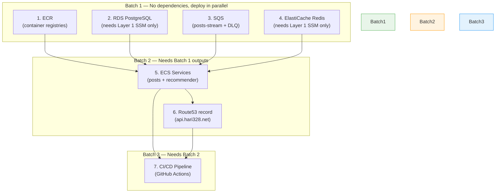

# Phase 2 — Deploy backend-patterns-ts to AWS

This document plans how to take the turborepo (2 services, 1 database, 1 queue) and deploy it on AWS on top of the base infrastructure from Phase 1.

---

## Layer 1 Recap (from infra-backend-patterns-ts)

| Resource | Detail |
|---|---|
| **AWS Account (stage)** | `hari328-stage` — `550933156245` |
| **AWS Account (prod)** | `hari328-prod` — `375032573014` |
| **Region** | `us-east-1` |
| **VPC** | `10.0.0.0/16` — 2 public, 2 private subnets, 1 NAT GW |
| **ECS Cluster** | `hari328-stage`, EC2-backed (t3.medium, ASG 1–3), capacity provider |
| **ALB** | Internet-facing, HTTPS listener (default 404), HTTP→HTTPS redirect |
| **DNS / SSL** | Route53 `hari328.net`, ACM wildcard `*.hari328.net` |
| **SSM Params** | `/infra/vpc-id`, `/infra/private-subnet-ids`, `/infra/cluster-arn`, `/infra/alb-listener-arn`, etc. |

---

## What needs to go to AWS

| Local Component | Description | AWS Target |
|---|---|---|
| **posts-service** | Express REST API (port 3000), publishes to SQS | ECS Service behind ALB |
| **recommender-service** | Express HTTP (port 6000) + SQS consumer, writes hashtags to DB | ECS Service behind ALB |
| **PostgreSQL** | Shared DB — users, posts, hashtags, comments, likes (Drizzle ORM) | RDS PostgreSQL |
| **SQS queue** (`posts-stream`) | posts-service publishes `POST_CREATED` → recommender-service consumes | Amazon SQS |
| **Redis** | Idempotency + backoff store for SQS consumer | ElastiCache Redis |

---

## Data flow

```
Client → ALB (HTTPS *.hari328.net)
           ├── api.hari328.net/posts/*     → posts-service (ECS)  ──→ RDS PostgreSQL
           │                                       │
           │                                       ↓ publish POST_CREATED
           │                                   SQS (posts-stream)
           │                                       ↓ consume
           └── api.hari328.net/hashtags/*  → recommender-service (ECS) ──→ RDS PostgreSQL
```

---

## Terraform modules (in this repo)

App-level infra lives in this repo (`backend-patterns-ts`) since it is tightly coupled to the app code. Base infra stays in `infra-backend-patterns-ts`.

### 1. ECR — Container registries

One ECR repo per service (standard pattern — independent build/deploy/rollback per service).

- `hari328-stage-posts-service`
- `hari328-stage-recommender-service`

### 2. RDS — PostgreSQL

- Engine: PostgreSQL 16
- Instance: `db.t3.micro` (stage, single-AZ, free-tier eligible)
- Subnets: private subnets (from Layer 1 SSM)
- Security group: inbound 5432 from ECS task SG only
- DB name: `social_media_db`
- Credentials: SSM Parameter Store SecureString (or Secrets Manager — TBD)

### 3. SQS — Queue

- `posts-stream` queue
- `posts-stream-dlq` dead letter queue (maxReceiveCount: 3)
- IAM: posts-service task role gets `sqs:SendMessage`
- IAM: recommender-service task role gets `sqs:ReceiveMessage`, `sqs:DeleteMessage`, `sqs:ChangeMessageVisibility`

### 4. ElastiCache — Redis

- Engine: Redis 7
- Node type: `cache.t3.micro` (stage, single-node)
- Subnets: private subnets (from Layer 1 SSM)
- Security group: inbound 6379 from ECS task SG only
- Used by recommender-service for SQS consumer idempotency and backoff stores

### 5. ECS Services (per service)

Each service gets:

| Resource | Purpose |
|---|---|
| Task definition | Container image, CPU/memory, env vars, log config |
| ECS service | Desired count, capacity provider strategy, deployment config |
| Target group | Health check path (`/health`), port |
| ALB listener rule | Path-based routing on the HTTPS listener |
| Security group | Inbound from ALB SG, outbound to RDS SG + internet (NAT) |
| IAM task role | Service-specific permissions (SQS, SSM, etc.) |
| IAM execution role | ECR pull, CloudWatch logs, SSM/Secrets read |
| CloudWatch log group | `/ecs/hari328-stage/{service-name}` |

Environment variables injected into containers:

**posts-service:**
- `DATABASE_URL` — from SSM SecureString or Secrets Manager
- `SQS_POSTS_STREAM_QUEUE_URL` — from SQS module output
- `AWS_REGION` — `us-east-1`
- `PORT` — `3000`
- `NODE_ENV` — `production`

**recommender-service:**
- `DATABASE_URL` — same RDS, same DB
- `SQS_POSTS_STREAM_QUEUE_URL` — from SQS module output
- `REDIS_URL` — from ElastiCache module output
- `AWS_REGION` — `us-east-1`
- `PORT` — `6000`
- `NODE_ENV` — `production`

### 6. Route53 Record

- `api.hari328.net` → ALB (Alias record)
- ALB listener rules on the HTTPS listener:
  - Path `/posts/*` → posts-service target group
  - Path `/hashtags/*` → recommender-service target group
  - Default → 404 (already set by Layer 1)

### 7. DB Migration Runner

- One-shot ECS `run-task` using the posts-service image (or a dedicated migration image)
- Override CMD: `npm run db:migrate --workspace=@repo/database`
- Runs in CI/CD before deploying new service versions
- Uses same private subnets and RDS access as the services


---

## CI/CD Pipeline (GitHub Actions)

```
Push to main
  ├── Build posts-service image       → Push to ECR
  ├── Build recommender-service image → Push to ECR
  ├── Run DB migrations (ECS run-task, waits for completion)
  ├── Deploy posts-service (ECS service update, force new deployment)
  └── Deploy recommender-service (ECS service update, force new deployment)
```

- Uses **OIDC** to assume a deployment role in `hari328-stage` (550933156245)
- OIDC provider is in a separate account — needs trust policy for this repo (`hari328/backend-patterns-ts`)
- Image tag strategy: git SHA (e.g., `abc1234`) + `latest`

---

## Open decisions

| # | Question | Options |
|---|---|---|
| 1 | **Terraform or Terragrunt in this repo?** | Infra repo uses Terragrunt. Plain Terraform may be simpler for app-level. |
| 2 | **Routing** | Single `api.hari328.net` with path-based routing vs separate subdomains |
| 3 | **RDS size** | `db.t3.micro` single-AZ for stage (cheapest) |
| 4 | **Secrets** | SSM SecureString (simpler) vs Secrets Manager (auto-rotation) |
| 5 | **DB seeding** | Migrations in CI/CD, seed manually or via a separate task |
| 6 | **OIDC trust** | Does the OIDC provider already trust this repo for stage deployments? |

---

## Module dependency order

```
1. ECR                          (no dependencies)
2. RDS                          (needs VPC/subnets from Layer 1 SSM)
3. SQS                          (no dependencies)
4. ElastiCache Redis            (needs VPC/subnets from Layer 1 SSM)
5. ECS services                 (needs ECR, RDS, SQS, ElastiCache, ALB from Layer 1 SSM)
6. Route53 record               (needs ALB from Layer 1 SSM)
7. CI/CD pipeline               (needs ECR repos, ECS cluster/services)
```

### Batching strategy



| Batch | Modules | Notes |
|-------|---------|-------|
| **1** | ECR, RDS, SQS, ElastiCache | All independent — `terragrunt run-all apply` |
| **2** | ECS Services, Route53 | Needs Batch 1 outputs (ECR URIs, RDS endpoint, SQS URL, Redis endpoint) |
| **3** | CI/CD Pipeline | GitHub Actions workflow — needs ECR repos + ECS services to exist |